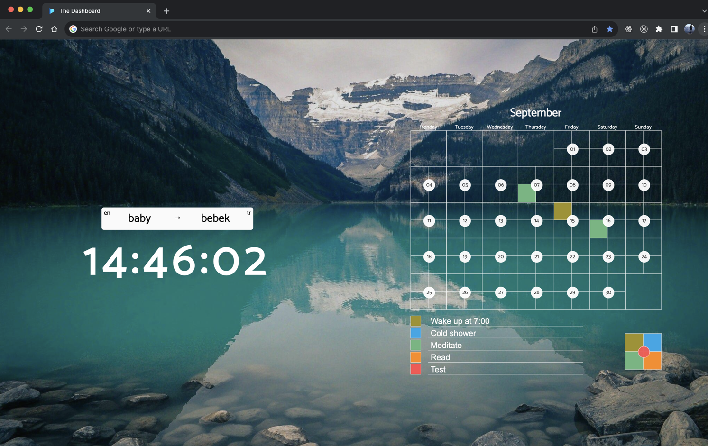

# word-of-the-tab-chrome-extension

## Description

This is a chrome extension that displays a new word every new tab. The word is fetched from the Google Translate history.

## Installation

1. Clone the repository
2. Go to `chrome://extensions/` in your browser
3. Click on `Load unpacked` and select the cloned repository
4. Click on the extension icon and click on `Start` to start the extension
5. Visit `https://translate.google.com/history` and wait for initial loading to complete
6. Click on the extension icon and click on `Stop` to stop the extension

## To-Do

- [x] Store words in local storage
- [x] Add new tab to display the word
- [x] Show translation direction
- [x] Update icons
- [ ] Add a button to fetch new words
- [ ] Add examples for the word

## Screenshots

